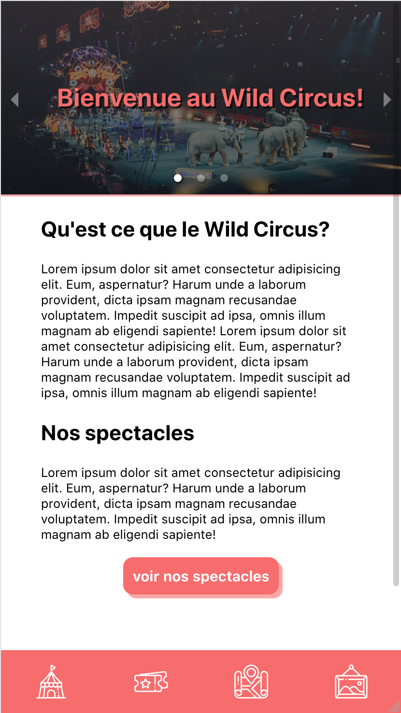
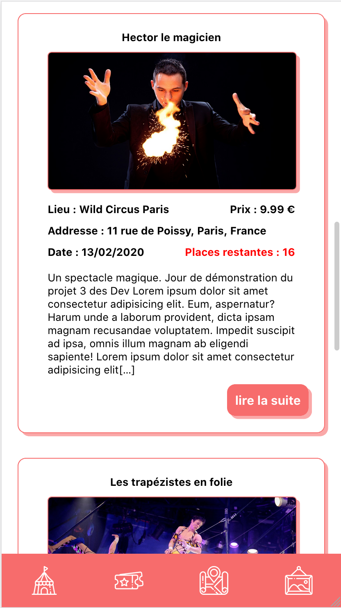
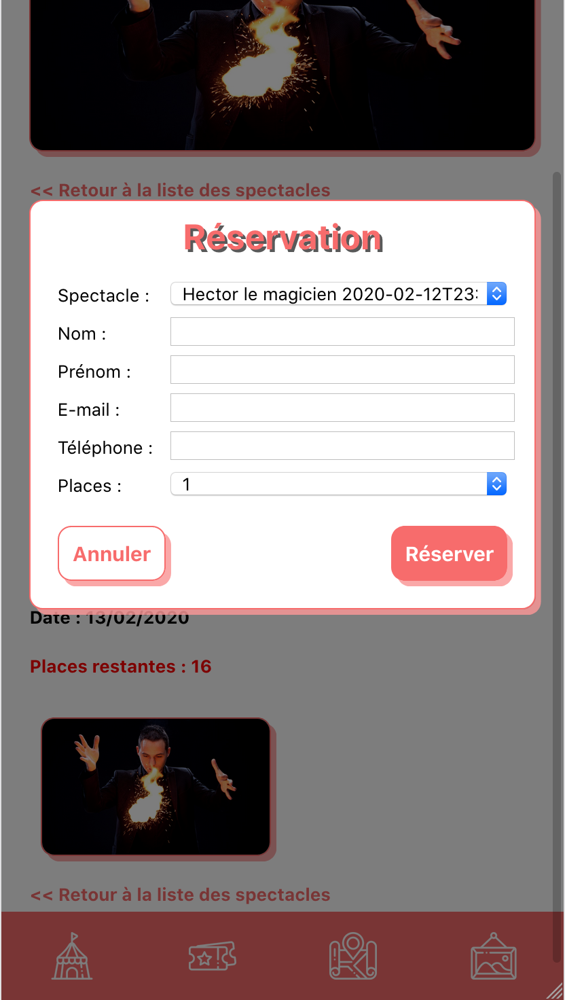
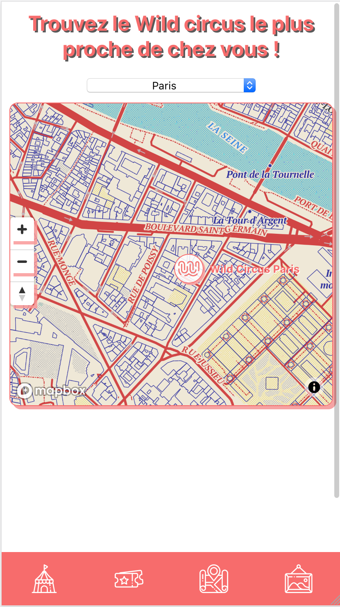
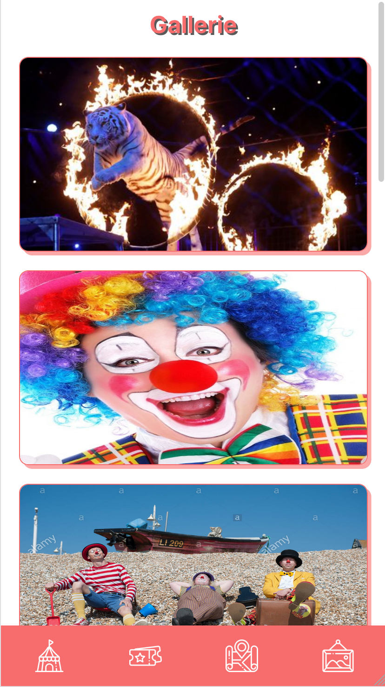

# WILD CIRCUS

## Project overview
Website for the fake circus company « WILD CIRCUS »

The site is divided in four screens : 
 - The 'Home' screen wich presents the Wild Circus company and what kind of performance usulay takes place in their circus.
 - The 'Performances' screen listing all the scheduled performances of the wild circus and where you can make a reservation for a performance.
 - The 'Map' screen wich shows a map of all the Wild circus around the world.
 - The 'Gallery' screen where you can see photos of the performances.  

## ---- screnshots ----





## ----

## Technologies used 
- REACT.JS for the front of the site
- Node.JS for the API
- MYSQL for the database

## Installation
Install packages in both ./back and ./front folders
```bash
npm install 
```

Install the sample database using the script in ./back/bdd/ folder \
Create a .env file in ./back folder using the following model 

DB_HOST=your database host \
DB_PORT=your database port \
DB_USER=your database user \
DB_PASS=your database password \
DB_DB=your database name 


## Usage
run start script in ./back then ./front folders
```bash
npm start
```

## MADE BY
- Paul-Arnaud Lacroix https://github.com/Paul-Arnaud